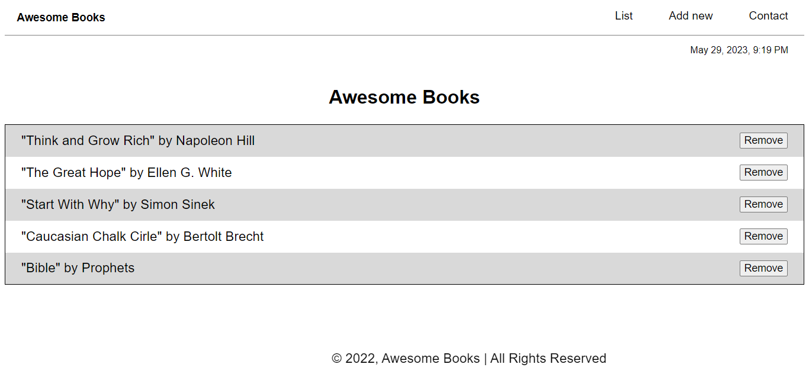

<a name="readme-top"></a>

<!-- TABLE OF CONTENTS -->

# 📗 Table of Contents

- [📖 About the Project](#about-project)
  - [🛠 Built With](#built-with)
  - [🚀 Live Demo](#live-demo)
- [💻 Getting Started](#getting-started)
- [👥 Authors](#authors)
- [🔭 Future Features](#future-features)
- [🤝 Contributing](#contributing)
- [⭐️ Show your support](#support)
- [🙏 Acknowledgements](#acknowledgements)
- [📝 License](#license)

<!-- PROJECT DESCRIPTION -->
# 📖 Awesome Books <a name="about-project"></a>

> Awesome books is a simple website that displays a list of books and allows you to add and remove books from that list.



 ✨ App features ✨

- Add a book to your collection.
- Remove a book from your collection.
- Preserve data in the local storage.
- View a list of books


## 🛠 Built With <a name="built-with"></a>
    . HTML
    . CSS
    . Javascript

<p align="right">(<a href="#readme-top">back to top</a>)</p>

<!-- LIVE DEMO -->

# 🚀 Live Demo <a name="live-demo"></a>

[Awesome Book](https://tobuya.github.io/Awesome-Books-ES6/)

<p align="right">(<a href="#readme-top">back to top</a>)</p>


<!-- GETTING STARTED -->

## 💻 Getting Started <a name="getting-started"></a>

To get started with this project, follow the instructions below:


<p align="right">(<a href="#readme-top">back to top</a>)</p>

### Prerequisites

In order to run this project you need:

- Node.js installed and configured

- Luxon library installed and configured

- VS Code or Any other code editor

- Any browser


<p align="right">(<a href="#readme-top">back to top</a>)</p>

### Setup

- Create a local directory that you want to clone the repository:
```
mkdir my-directory
```

- Navigate to the created directory:
```
cd my-directory
```

- Clone this repository into the folder:
```
git clone https://github.com/tobuya/Awesome-Books-ES6
```

- Navigate to the cloned repository folder:
```
cd Awesome-Books-ES6
```

- Setup ESLint and Stylelint
```
npm install --save-dev eslint@7.x eslint-config-airbnb-base@14.x eslint-plugin-import@2.x babel-eslint@10.x
npm install --save-dev stylelint@13.x stylelint-scss@3.x stylelint-config-standard@21.x stylelint-csstree-validator@1.x
```

- Install Node development dependencies
```
npm install --save-dev
```


<p align="right">(<a href="#readme-top">back to top</a>)</p>

<!-- Author -->

## 👤**Authors** <a name="authors"></a>


👤 **Thomas Obuya**

- GitHub: [@githubhandle](https://github.com/tobuya)
- Twitter: [@twitterhandle](https://twitter.com/@MullerTheGreat1)
- LinkedIn: [LinkedIn](https://linkedin.com/in/tobuya/)

<p align="right">(<a href="#readme-top">back to top</a>)</p>

<!-- FUTURE FEATURES -->

## 🔭 Future Features <a name="future-features"></a>

- Implement some UX improvements: add a home page, include transitions and/or animation

- Implement additional pages, which will allow the user to Register

- Implement additional pages, which will allow the user to Login

<p align="right">(<a href="#readme-top">back to top</a>)</p>

<!-- CONTRIBUTING -->

## 🤝 Contributing <a name="contributing"></a>

Contributions, issues, and feature requests are welcome!

Feel free to check the issues page.

<p align="right">(<a href="#readme-top">back to top</a>)</p>

<!-- SUPPORT -->

## ⭐️ Show your support <a name="support"></a>

Give a ⭐️ if you like this project!

<p align="right">(<a href="#readme-top">back to top</a>)</p>

<!-- ACKNOWLEDGEMENTS -->

## 🙏 Acknowledgments <a name="acknowledgements"></a>

- I would like to acknowledge the use of [Luxon library](https://imdac.github.io/modules/js/luxon/) to handle dates, times, and durations in a convenient and efficient manner.

<p align="right">(<a href="#readme-top">back to top</a>)</p>

## 📝 License <a name="license"></a>
This project is [MIT](./LICENCE) licensed.


<p align="right">(<a href="#readme-top">back to top</a>)</p>
